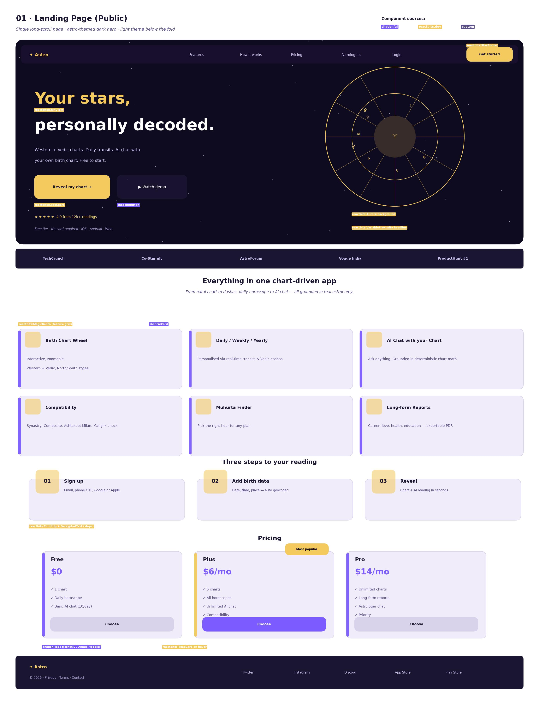
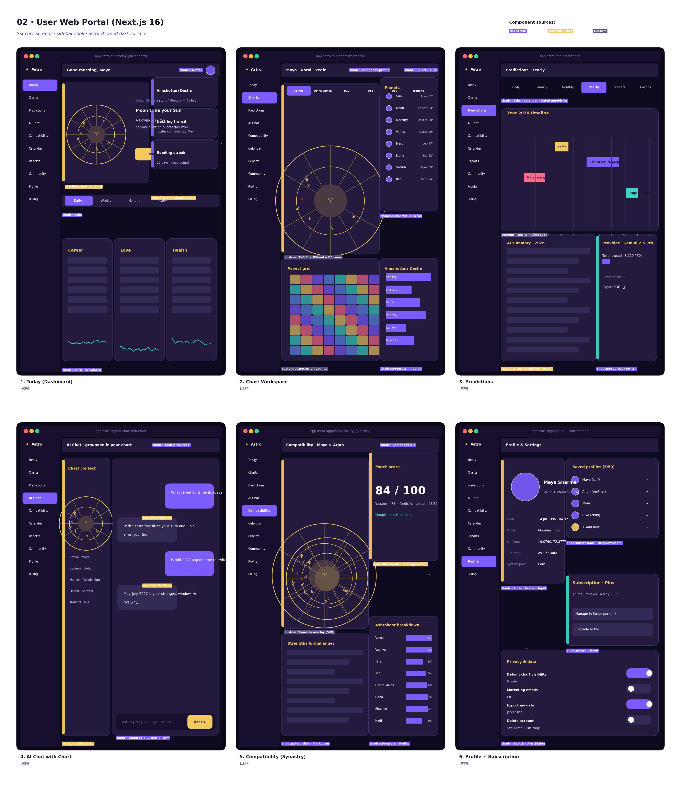
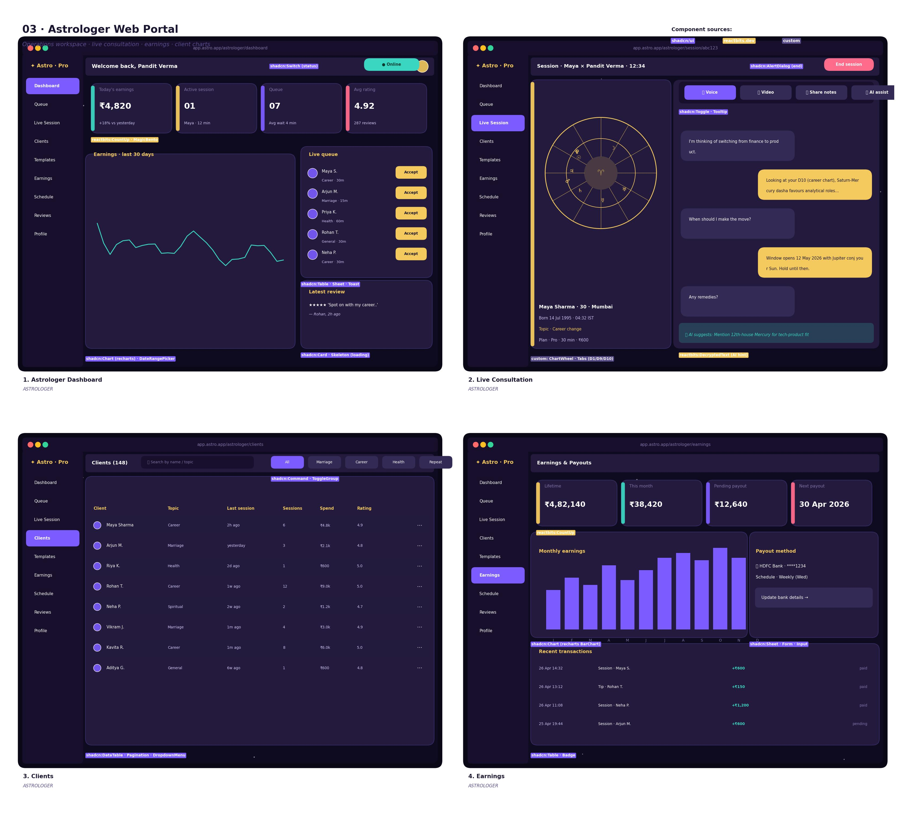
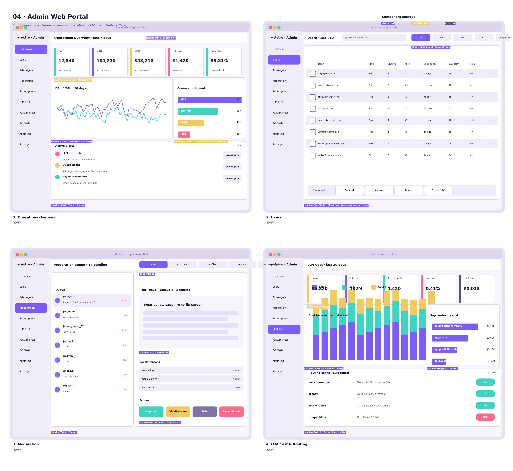
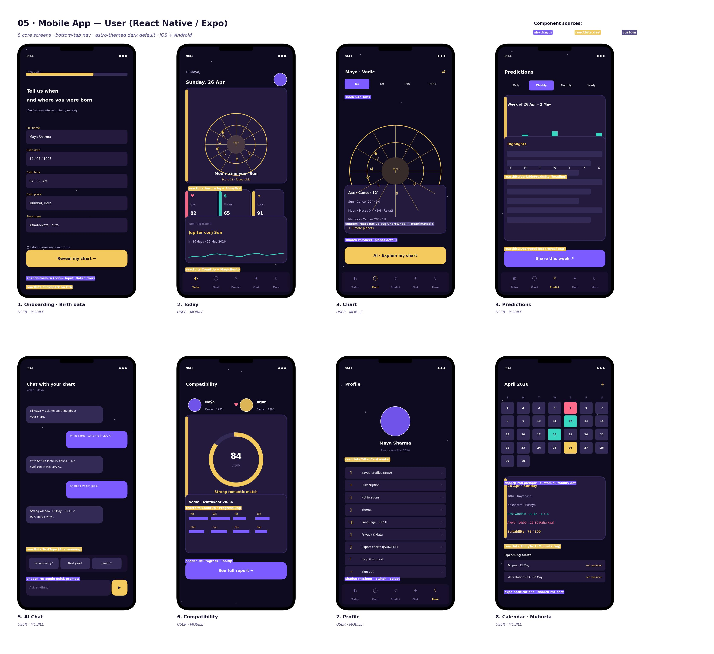
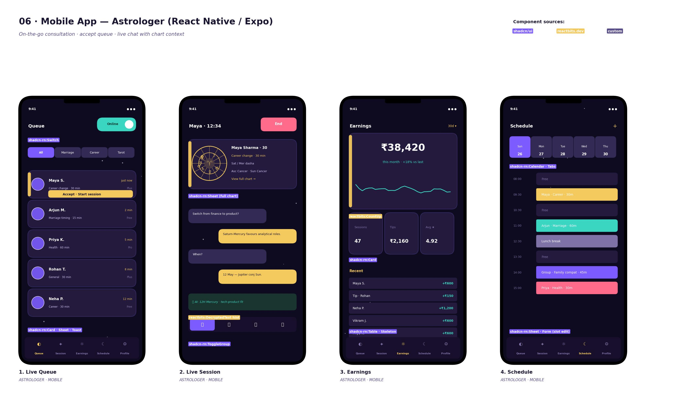

% Astrology App — Design Specification
% Web Portals · Landing Site · Mobile Apps
% Version 1.0 · 2026-04-26

---

# Table of Contents

| # | Section | Page |
|---|---------|-----:|
| 1 | [Overview](#1-overview) | 1 |
| 2 | [Persona Map](#2-persona-map) | 2 |
| 3 | [Design System](#3-design-system) | 3 |
| 3.1 | [Brand Theme](#31-brand-theme--celestial-night) | 3 |
| 3.2 | [Color Tokens](#32-color-tokens) | 4 |
| 3.3 | [Typography](#33-typography) | 5 |
| 3.4 | [Spacing, Radius, Elevation](#34-spacing-radius-elevation) | 5 |
| 3.5 | [Iconography & Glyphs](#35-iconography--glyphs) | 6 |
| 4 | [Component Library Strategy](#4-component-library-strategy) | 7 |
| 4.1 | [shadcn/ui Inventory](#41-shadcnui-inventory-web) | 7 |
| 4.2 | [reactbits.dev Inventory](#42-reactbitsdev-inventory) | 8 |
| 4.3 | [Mobile Component Mapping](#43-mobile-component-mapping-react-native) | 9 |
| 4.4 | [Custom Components](#44-custom-components-built-in-house) | 10 |
| 5 | [Landing Page](#5-landing-page-public) | 11 |
| 6 | [User Web Portal](#6-user-web-portal) | 14 |
| 7 | [Astrologer Web Portal](#7-astrologer-web-portal) | 19 |
| 8 | [Admin Web Portal](#8-admin-web-portal) | 22 |
| 9 | [Mobile App — User](#9-mobile-app--user) | 25 |
| 10 | [Mobile App — Astrologer](#10-mobile-app--astrologer) | 29 |
| 11 | [Key User Flows](#11-key-user-flows) | 31 |
| 12 | [Accessibility & Internationalisation](#12-accessibility--internationalisation) | 32 |
| 13 | [Motion & Animation Guidelines](#13-motion--animation-guidelines) | 33 |
| 14 | [Empty, Loading & Error States](#14-empty-loading--error-states) | 34 |
| 15 | [Hand-off & Implementation Notes](#15-hand-off--implementation-notes) | 35 |

---

# 1. Overview

This document defines the visual design, component composition, screen inventory and interaction patterns for the **Astrology App** across:

- **Public landing site** (Next.js 16, server-rendered, marketing).
- **Web portals** for **User**, **Astrologer**, **Admin** (Next.js 16 App Router, signed-in shells).
- **Mobile apps** for **User** and **Astrologer** (React Native + Expo, single codebase per app).

The component strategy combines two libraries:

- **shadcn/ui** — accessible, headless-by-default React primitives (forms, tables, sheets, dialogs, charts via Recharts). Drives **structure and accessibility**.
- **reactbits.dev** — a curated set of animated, copy-paste React components (Aurora, StarField, MagicBento, ShinyText, TextType, DecryptedText, TiltedCard, ClickSpark, CountUp, etc.). Drives **delight, motion, and the celestial brand**.

Custom components fill the gap where domain logic is unique — most importantly the **Chart Wheel renderer** (Western and Vedic North/South Indian), the **Aspect Grid heatmap**, **Synastry Overlay**, and the **TransitTimeline**.

> **Note on mobile:** `shadcn/ui` ships React-DOM components; on React Native we use the parallel ports referenced as `shadcn-rn:*` throughout this document — concretely **shadcn/react-native** (community port) plus **NativeWind** for Tailwind-class parity, **Tamagui** as the underlying design-system primitives, and **Reanimated 3** for motion. reactbits-style effects on mobile are re-implemented with `react-native-skia` + `Reanimated`.

---

# 2. Persona Map

| Persona | Surface | Primary jobs |
|---------|---------|--------------|
| Visitor | Landing site | Understand value, sign up, install app |
| User (free / Plus / Pro) | User web + mobile | Read horoscopes, generate charts, chat with chart, book astrologers |
| Astrologer | Astrologer web + mobile | Take queue, run live consultations, manage earnings, schedule |
| Admin / Ops | Admin web | Monitor health, moderate content, manage subscriptions, watch LLM cost, run experiments |

Each persona has its own shell (sidebar items, top bar, branding tone). Visitors and users share the brand "celestial night"; admins use a **light operations** variant of the same tokens for clarity at high information density.

---

# 3. Design System

## 3.1 Brand Theme — *Celestial Night*

Two skins of one system:

- **Astro (default for end-users)** — deep indigo background, gold accents, subtle starfield, soft violet glow. Conveys mystery + warmth.
- **Light Operations (admin)** — same hue family but inverted to a near-white background with violet accents. Optimised for tables, charts, and dense data.

Both skins share radii, spacing, motion timing, and typographic scale.

## 3.2 Color Tokens

Tokens are defined as CSS variables and consumed via Tailwind's theme extension. Names match those used in the wireframe code (`docs/design/wireframes/_wf.py`).

| Token | Astro (dark) | Light Ops | Use |
|-------|--------------|-----------|-----|
| `--bg`            | `#0e0a1f` | `#f7f5fb` | Page background |
| `--surface`       | `#1a1530` | `#ffffff` | Top-level cards / shell |
| `--surface-2`     | `#231a3d` | `#f0ecfa` | Inset cards |
| `--border`        | `#3a2f6b` | `#d8d2eb` | Hairlines |
| `--ink`           | `#e9e3ff` | `#1a1530` | Primary text |
| `--ink-muted`     | `#998fc7` | `#5a4d8c` | Secondary text |
| `--brand-gold`    | `#f4c95d` | `#f4c95d` | Highlight / Astro accent |
| `--brand-violet`  | `#7c5cff` | `#7c5cff` | Primary action |
| `--brand-aqua`    | `#3ad6c2` | `#3ad6c2` | Success / positive |
| `--brand-rose`    | `#ff6b8a` | `#ff6b8a` | Danger / destructive |

Semantic aliases: `success = aqua`, `warning = gold`, `destructive = rose`, `info = violet`.

Contrast: Every text-on-surface combination meets WCAG 2.2 AA (verified at design time; lint runs in CI via `axe-core` for the web app).

## 3.3 Typography

| Role | Web | Mobile | Notes |
|------|-----|--------|-------|
| Display | Fraunces (var) | Fraunces SemiBold | Headlines, hero |
| Body | Inter (var) | Inter | UI copy |
| Numerals | Inter Tabular | Inter Tabular | Tables, chart degrees |
| Sanskrit / Hindi | Noto Serif Devanagari | Noto Sans Devanagari | i18n |
| Glyphs | Noto Sans Symbols 2 | system fallback | Planet/zodiac glyphs |

Type scale (rem on web, sp on mobile): 12 / 14 / 16 / 18 / 20 / 24 / 30 / 36 / 48 / 60. Body default `16/24`. Headlines use −2% letter-spacing.

## 3.4 Spacing, Radius, Elevation

- **Spacing scale** (px): 4 · 8 · 12 · 16 · 20 · 24 · 32 · 40 · 48 · 64. Tailwind `space-*` aligns 1:1.
- **Radius**: `xs 4`, `sm 8`, `md 12`, `lg 16`, `xl 24`, `pill 999`. Cards default `lg`, modal/sheet `xl`, buttons `pill` on landing/CTA, `md` everywhere else.
- **Elevation** (dark uses gold-tinted glow, light uses violet-tinted shadow):
  - `e1` — soft hairline (cards): `0 1px 0 rgba(...)`
  - `e2` — standard card lift: `0 4px 16px rgba(124,92,255,0.08)`
  - `e3` — modal / sheet: `0 24px 48px rgba(0,0,0,0.45)` (dark) / `(124,92,255,0.18)` (light)

## 3.5 Iconography & Glyphs

- **UI icons**: `lucide-react` (web) / `lucide-react-native` (mobile). Stroke `1.5`, size 16 / 20 / 24.
- **Astrology glyphs**: Unicode block `Symbols 2 (U+263F – U+26FF)` for planets and zodiac, fallback to a tiny custom SVG sprite for crisp rendering at small sizes.
- **Empty-state illustrations**: 6 hand-illustrated SVG scenes (constellation, telescope, scroll, etc.) — produced by design lead at handoff.

---

# 4. Component Library Strategy

## 4.1 shadcn/ui Inventory (Web)

Generated into `src/frontend/components/ui/` on first install; we *do not* install all of them — only the curated list below. Each is themed with our tokens.

| Group | Components |
|-------|-----------|
| Inputs | Button, Input, Textarea, Form, Label, Checkbox, RadioGroup, Switch, Select, Combobox, DatePicker, DateRangePicker, Slider, Toggle, ToggleGroup, InputOTP |
| Layout / Containers | Card, Sheet, Dialog, AlertDialog, Drawer, Tabs, Accordion, Collapsible, Separator, ScrollArea, ResizablePanels, Sidebar |
| Data | Table, DataTable (TanStack), Pagination, Command (cmdk), Calendar, Chart (Recharts wrapper), Progress, Skeleton, Avatar, Badge |
| Feedback | Toast (Sonner), Tooltip, HoverCard, Popover, ContextMenu, DropdownMenu, AlertDialog, Banner |
| Theming | ThemeProvider, theme switcher (using `next-themes`) |

Anything outside this list goes through design review before adding — keeps the bundle small and the system coherent.

## 4.2 reactbits.dev Inventory

Used for delight and the celestial brand. Components are copied (not npm-installed) into `src/frontend/components/effects/` so we can adapt them. Below is the curated list and where each is used.

| Component | Where it appears | Purpose |
|-----------|------------------|---------|
| **Aurora** (background) | Landing hero · User Today hero | Mystical animated gradient |
| **StarField / Particles** | Landing hero · Mobile splash · onboarding | Celestial atmosphere |
| **Squares / Beams** | Admin dashboard background (subtle) | Texture without distraction |
| **VariableProximity** (text) | Landing headline · Predictions title | Hover-reactive headline |
| **ShinyText** | Hero CTA labels · Muhurta tag | Premium shimmer |
| **DecryptedText** | "Reveal" interactions in Predictions / Reports / AI hints | Reinforces "decode the stars" metaphor |
| **TextType** | AI Chat assistant streaming bubble | Typewriter feel for live AI output |
| **MagicBento** | Landing feature grid · User dashboard tiles · Admin KPI grid | Animated grid with hover spotlight |
| **SpotlightCard** | Today's hero card · Premium upsell cards | Hover spotlight follow |
| **TiltedCard** | Pricing cards · Profile avatar card · Compatibility result | 3D tilt on hover |
| **CountUp** | KPIs (DAU, earnings, scores) | Animated number entry |
| **ClickSpark** | Primary CTA on landing · Onboarding "Reveal" button | Tactile feedback |
| **StarBorder** | "Get started" pill · subscribed-tier card | Twinkling border on key surfaces |
| **GradientText** | Logo wordmark · Section headings | On-brand gradient text |

> **Performance contract:** any reactbits component that animates continuously is paused via `IntersectionObserver` / Reanimated `useAnimatedReaction` when off-screen. On low-power mode (battery < 20% on mobile, `prefers-reduced-motion` on web) we degrade to a static fallback.

## 4.3 Mobile Component Mapping (React Native)

| Web (shadcn/ui) | Mobile (RN) | Library |
|-----------------|-------------|---------|
| Button | `Pressable` + Tamagui `Button` | tamagui |
| Card | `View` + Tamagui `Card` | tamagui |
| Sheet | `BottomSheet` | `@gorhom/bottom-sheet` |
| Dialog / AlertDialog | RN `Modal` + custom | RN core |
| Tabs | `react-native-tab-view` | community |
| DataTable | `FlashList` + custom rows | shopify |
| Form / Input | `react-hook-form` + Tamagui inputs | rhf + tamagui |
| Calendar | `react-native-calendars` | community |
| Chart | `victory-native` (Recharts equivalent) | community |
| Toast | `sonner-native` | community |
| Skeleton | `react-native-skeleton-placeholder` | community |
| Tooltip | custom popover (RN) | in-house |
| Avatar | `expo-image` + circular mask | expo |
| Switch | RN core `Switch` (themed) | RN core |
| Combobox | `react-native-bottom-sheet` + custom | composite |

reactbits-style motion → re-built with **Reanimated 3 + Skia**:

- Aurora / StarField → `@shopify/react-native-skia` shaders.
- TextType / DecryptedText → Reanimated derived value drives character index.
- TiltedCard → Reanimated `useAnimatedSensor(gyroscope)` for tilt.
- CountUp → Reanimated `withTiming` over numeric shared value.
- MagicBento → Reanimated layout grids with shared element transitions.

## 4.4 Custom Components (Built In-house)

| Component | Description | Uses |
|-----------|-------------|------|
| `<ChartWheel />` | SVG-based chart wheel with planets, houses, signs, aspects. Variants: Western circular, North-Indian diamond, South-Indian square. | All chart screens |
| `<AspectGrid />` | Heatmap grid of planet-vs-planet aspects with tooltip drill-down. | Chart Workspace, AI Chat context |
| `<SynastryOverlay />` | Two ChartWheels overlaid with composite midpoints highlighted. | Compatibility |
| `<TransitTimeline />` | D3 horizontal timeline of transits/dashas with bands. | Predictions, Calendar |
| `<DashaProgress />` | Stacked Vimshottari progress bar with sub-periods. | Chart Workspace, Reports |
| `<MuhurtaDayCard />` | Tithi, nakshatra, suitability score, do/don't list. | Calendar |
| `<ChartChat />` | AI chat shell that injects chart-JSON context invisibly. | AI Chat |
| `<ShareCard />` | OG/social card generator for daily horoscope. | Today screen |

---

# 5. Landing Page (Public)

**Goal:** convert a cold visitor into a signed-up user in under 60 seconds.

**Sections (top → bottom):**

1. **Hero** — Aurora background with subtle StarField; left column has the headline (VariableProximity), sub-copy, primary CTA `Reveal my chart →` (ClickSpark on press) and a secondary `▶ Watch demo`. Right column shows a slowly rotating `<ChartWheel />`.
2. **Trust bar** — press logos / ratings / install counts.
3. **Features grid** — 6 features in a `MagicBento` 3×2 grid; each tile is a shadcn `Card` with a glyph and 2-line summary.
4. **How it works** — 3 numbered steps with animated entry (CountUp on the step numbers, DecryptedText on the step titles).
5. **Pricing** — 3 plans as `TiltedCard`s; "Plus" gets `StarBorder` + a "Most popular" badge. Toggle Monthly/Annual via shadcn `Tabs`.
6. **Testimonials** — Carousel of `SpotlightCard`s (shadcn `Carousel` for structure).
7. **App download** — App Store / Play Store badges, mobile mockup screenshot.
8. **Footer** — sitemap, legal links, social, language toggle.

**Components used:** `reactbits:Aurora`, `reactbits:StarField`, `reactbits:VariableProximity`, `reactbits:ShinyText`, `reactbits:MagicBento`, `reactbits:TiltedCard`, `reactbits:StarBorder`, `reactbits:ClickSpark`, `reactbits:CountUp`, `reactbits:DecryptedText`; `shadcn:Button`, `shadcn:Card`, `shadcn:Tabs`, `shadcn:Carousel`, `shadcn:Sheet (mobile nav)`.

**Performance:** Hero loads under 2.0s LCP on mid-tier 4G mobile. Heavy reactbits effects are deferred to post-LCP via `requestIdleCallback`.

---

# 6. User Web Portal

The user portal uses a **collapsible sidebar shell** (shadcn `Sidebar` primitive, new in late 2025) with 10 nav items: Today, Charts, Predictions, AI Chat, Compatibility, Calendar, Reports, Community, Profile, Billing.

### 6.1 Today (Dashboard)
**Purpose:** the daily landing surface — what's happening for me right now.

- Header card: chart wheel preview + the day's headline aspect (`reactbits:SpotlightCard`).
- Right column tiles: dasha summary, next big transit, reading streak (`reactbits:MagicBento`).
- Tabs: Daily / Weekly / Monthly / Yearly (`shadcn:Tabs`).
- Mini cards under tabs: Career, Love, Health (`shadcn:Card` + sparklines).
- CTA tile inviting AI chat or report generation.

### 6.2 Chart Workspace
**Purpose:** the pro tool — explore the chart in depth.

- Top bar: profile combobox, system + house selectors (`shadcn:Combobox`, `shadcn:Select`).
- Tab strip for divisional charts: D1, D9, D10, D12, D60, Transits.
- Center: large `<ChartWheel />` with zoom and orb sliders.
- Right rail: `<PlanetTable />` (shadcn `Table` with virtualized rows).
- Bottom: `<AspectGrid />` and `<DashaProgress />`.

### 6.3 Predictions
**Purpose:** zoom out to the year.

- Tabs: Daily / Weekly / Monthly / Yearly / Transits / Dashas (`shadcn:Tabs`).
- Yearly: `<TransitTimeline />` with coloured bands per transit.
- Long-form AI summary card with `reactbits:DecryptedText` reveal.
- Right card: provider / token / cost meter (transparency).

### 6.4 AI Chat with Chart
**Purpose:** unbounded Q&A grounded in the user's chart math.

- Left rail: chart context card (`reactbits:TiltedCard`) — wheel + key facts.
- Right pane: chat thread; assistant bubbles use `reactbits:TextType` for streaming feel.
- Input: shadcn `Textarea` + `Button`. Quick-prompt chips above the input.
- "Sources" tooltip on each AI answer (shadcn `Tooltip`).

### 6.5 Compatibility (Synastry)
**Purpose:** check the relationship.

- Picker: two profiles (shadcn `Combobox` × 2).
- Left: `<SynastryOverlay />` of two wheels.
- Right: animated score (`reactbits:CountUp` 0→84) inside a progress ring, plus Manglik / Ashtakoot breakdown bars.
- Bottom: long-form "strengths & challenges" (shadcn `Accordion`).

### 6.6 Profile + Subscription
**Purpose:** identity, profiles, plan, privacy.

- Identity card (avatar, birth data, system pref).
- Multi-profile list (shadcn `DataTable` with row menu).
- Subscription card with portal link (Stripe).
- Privacy controls — shadcn `Switch` rows for visibility, marketing, delete account (`shadcn:AlertDialog`).

> **Other user screens** (not pictured but in scope) follow the same shell: Calendar (Muhurta + transits, see mobile mock), Reports (long-form AI export), Community feed, Billing/invoices.

---

# 7. Astrologer Web Portal

Astrologer shell uses the **Astro skin** with a `Pro` badge in the logo. 9 nav items: Dashboard, Queue, Live Session, Clients, Templates, Earnings, Schedule, Reviews, Profile.

### 7.1 Dashboard
KPIs (today's earnings, active session, queue, rating) in `reactbits:MagicBento`. Earnings sparkline (Recharts) and live queue with "Accept" buttons. Online/offline status toggle in top bar (shadcn `Switch`).

### 7.2 Live Consultation
Split layout: client mini-chart context on the left, chat thread + voice/video toggles on the right. AI-assist hint bar surfaces relevant chart facts in real time (`reactbits:DecryptedText`). End-session button gated by shadcn `AlertDialog` to avoid accidental termination.

### 7.3 Clients
Searchable, filterable `shadcn:DataTable` with rows for client, topic, last session, total spend, average rating. Row menu opens a sheet with the client's chart and notes (shadcn `Sheet`).

### 7.4 Earnings
KPI strip + monthly bar chart + payout method form + recent transactions list. Payout settings live in a shadcn `Sheet` to keep the page calm.

> **Templates** (saved prompt blocks for common readings), **Schedule** (slot calendar), **Reviews** (paginated list), and **Profile** (verification, photo, languages) follow the same patterns and are not pictured separately.

---

# 8. Admin Web Portal

Admin uses the **Light Operations** skin for clarity at high information density. 10 nav items: Overview, Users, Astrologers, Moderation, Subscriptions, LLM Cost, Feature Flags, A/B Tests, Audit Log, Settings.

### 8.1 Overview
- 5 KPI cards (DAU, MAU, MRR, LLM cost, crash-free).
- DAU/MAU 90-day chart (`shadcn:Chart` AreaChart).
- Conversion funnel (custom built from shadcn `Progress` + labels).
- Active alerts panel — clickable to drill into incidents.

### 8.2 Users
A `shadcn:DataTable` with row checkboxes, search (`shadcn:Command`), filter chips (Plan, Risk, Country). Bulk action bar at the bottom: Email all, Suspend, Refund, Export CSV. Row click opens a `Sheet` with user detail, sessions, charts, billing, audit timeline.

### 8.3 Moderation
Two-pane layout: queue list on the left, detail viewer on the right. Detail shows the offending content, report reasons, and a row of action buttons (Approve, Add disclaimer, Hide, Suspend user) — destructive actions go through an `AlertDialog`.

### 8.4 LLM Cost & Routing
- KPIs: spend, tokens, p95 latency, error rate, cost per user.
- Stacked bar chart showing cost split by provider (Gemini / Groq / Claude) per day.
- Top routes by cost, ranked.
- Routing config table — toggle providers per route via `shadcn:Switch`. Editing the routing rule opens a code editor in a `Sheet`.

> **Astrologers** (verification queue, payout limits, KYC), **Subscriptions** (Stripe sync, churn cohorts), **Feature Flags** (variant control), **A/B Tests** (per-template lift), **Audit Log** (immutable timeline), and **Settings** all follow the same `DataTable + Sheet` pattern.

---

# 9. Mobile App — User

**Navigation:** bottom-tab bar with 5 tabs — Today, Chart, Predictions, AI Chat, More. Onboarding is a full-screen flow before first tab.

### 9.1 Onboarding · Birth Data (3 steps)
- Step 1: account (email/phone OTP/Google/Apple — handled by `expo-auth-session`).
- Step 2 (pictured): birth data — name, date, time, place (auto-geocoded via shadcn-rn `Combobox` calling our Nominatim/OpenCage proxy), timezone (auto). "Don't know my time" checkbox sets the rectified-chart flag.
- Step 3: system preference (Western / Vedic / Both) and notification permission ask. Reanimated step progress bar at top.

### 9.2 Today
The mobile equivalent of the web Today screen. Hero card (Aurora bg, chart wheel preview, headline aspect). Three mini-cards Love / Money / Luck (`reactbits:MagicBento` mobile port). Next-big-transit card with sparkline.

### 9.3 Chart
Tabs for D1 / D9 / D10 / Transits. Centerpiece: `<ChartWheel />` rendered with `react-native-svg` and animated by Reanimated (rotate to current degree, pinch-to-zoom). Tap a planet → bottom sheet with details (shadcn-rn `Sheet`). CTA: "AI · Explain my chart".

### 9.4 Predictions
Tabs Daily / Weekly / Monthly / Yearly. Weekly view: 7-day suitability bars. Below: AI-narrated highlights with `reactbits:DecryptedText` reveal. Share button generates a `<ShareCard />` and opens the OS share sheet.

### 9.5 AI Chat
Streaming bubbles (`reactbits:TextType` ported via Reanimated). Quick-prompt chips above the input. Input has a gold send button — long-press to record voice (Phase 2).

### 9.6 Compatibility
Two avatars at the top (current user + selected partner). Big animated score ring (`reactbits:CountUp`). Ashtakoot mini-grid below. CTA opens the full report.

### 9.7 Profile
Profile card + grouped settings list (Saved profiles, Subscription, Notifications, Theme, Language, Privacy, Export, Help, Sign out).

### 9.8 Calendar · Muhurta
Month grid with suitability dots (gold / aqua / rose). Selected day card shows tithi, nakshatra, best window, avoid window, suitability score. Upcoming alerts list with set-reminder action (uses `expo-notifications`).

---

# 10. Mobile App — Astrologer

**Navigation:** 5-tab bottom bar — Queue, Session, Earnings, Schedule, Profile.

### 10.1 Live Queue
Online/offline `Switch` in the top right. Filter chips for topic (Marriage, Career, Tarot). Cards for each waiting client with name, topic, wait time and plan. Top card highlighted with gold border + "Accept · Start session" button.

### 10.2 Live Session
Top: session timer + End button (gated by `AlertDialog`). Client mini-chart context card with key facts. Chat thread below. AI-assist hint pill surfaces relevant chart points. Mode toggles at the bottom: text / voice / video / attachments.

### 10.3 Earnings
Hero: ₹38,420 with `reactbits:CountUp` and trend. Mini-KPIs: Sessions, Tips, Avg rating. Recent transactions list with status.

### 10.4 Schedule
Week strip + time-slot list. Each slot is colour-coded by booking status. Tap a slot → edit sheet (shadcn-rn `Sheet` with `Form`).

> **Profile** (verification status, photo, languages, payout bank details) is the fifth tab and reuses the User Profile pattern.

---

# 11. Key User Flows

> Below are the four highest-traffic flows, written as `goal → step → component → outcome` so they can be implemented and tested directly. Other flows (compatibility, report generation, astrologer booking) follow the same structure and are documented in `docs/design/flows/` (per-flow markdown).

### 11.1 First-time User → Personalised Reading

| # | Step | Surface | Components | Success signal |
|---|------|---------|-----------|----------------|
| 1 | Land on hero | Landing | Aurora, VariableProximity, ClickSpark CTA | Click `Reveal my chart` |
| 2 | Sign up | Auth modal | shadcn:Form, Input, Button, NextAuth | Account created |
| 3 | Birth data | Onboarding step 2 | shadcn:DatePicker, Combobox (geocoding) | Lat/long resolved |
| 4 | Compute chart | Loader | shadcn:Skeleton + reactbits:StarField | Chart JSON ready |
| 5 | First reveal | Today | reactbits:DecryptedText + SpotlightCard | User reads first reading |
| 6 | Save streak | Today (next day) | reactbits:CountUp | Streak +1 |

### 11.2 User Asks AI Chat a Career Question

| # | Step | Surface | Components | Success signal |
|---|------|---------|-----------|----------------|
| 1 | Open AI Chat | Sidebar nav / mobile tab | shadcn:Sidebar / TabBar | Chat screen mounts |
| 2 | Type prompt | Input | shadcn:Textarea | Submit |
| 3 | Stream answer | Bubble | reactbits:TextType | Tokens visible <600ms first token |
| 4 | Show sources tooltip | Bubble | shadcn:Tooltip | Cites chart facts |
| 5 | Save to "My readings" | Action | shadcn:DropdownMenu | Persisted to DB |

### 11.3 Astrologer Takes a Live Session

| # | Step | Surface | Components | Success signal |
|---|------|---------|-----------|----------------|
| 1 | Toggle Online | Dashboard top bar | shadcn:Switch | Status pushed to server |
| 2 | Accept queue card | Queue | shadcn:Card + Button | Session created |
| 3 | See client chart | Live Session | custom:ChartWheel | Chart loads <500ms |
| 4 | Use AI hint | Hint bar | reactbits:DecryptedText | Suggestion appears |
| 5 | End session | Top bar | shadcn:AlertDialog | Receipt + payout queued |

### 11.4 Admin Investigates an LLM Cost Spike

| # | Step | Surface | Components | Success signal |
|---|------|---------|-----------|----------------|
| 1 | See alert | Overview | shadcn:Alert + Toast | Click "Investigate" |
| 2 | Open LLM Cost | Sidebar | Light skin sidebar | Cost dashboard mounts |
| 3 | Drill route | Top routes panel | shadcn:Progress + Tooltip | Route identified |
| 4 | Edit routing | Routing config | shadcn:Switch + Sheet (code editor) | Switch provider, save |
| 5 | Verify | Real-time chart | shadcn:Chart | Cost curve flattens |

---

# 12. Accessibility & Internationalisation

- **WCAG 2.2 AA** target across all surfaces. CI fails the build if `axe-core` finds a serious violation on a key route.
- All interactive elements ≥ 44 × 44 pt touch target on mobile.
- Focus rings: 2px violet outline on dark, 2px gold on light. Never removed.
- **VoiceOver / TalkBack**: every chart-wheel planet renders an accessible label like "Sun in Cancer at 22 degrees, first house". Decorative effects (StarField, Aurora) are aria-hidden.
- **Reduced motion**: when `prefers-reduced-motion: reduce` is true (web) or `Reduce Motion` is on (iOS) / `Remove animations` on Android — Aurora becomes a still gradient, TextType becomes instant text, CountUp becomes the final value.
- **i18n**: EN, HI, plus 2 regional Indian languages chosen at kickoff. RTL not in scope for v1. Number formatting via `Intl.NumberFormat`. Astrology terms keep the Sanskrit/IAST original alongside the translation in glossary entries.

---

# 13. Motion & Animation Guidelines

| Property | Token | Use |
|----------|-------|-----|
| Easing | `cubic-bezier(0.22, 1, 0.36, 1)` | Default for entrances |
| Easing | `cubic-bezier(0.65, 0, 0.35, 1)` | Default for exits |
| Duration | `150ms` | Hover / micro-interactions |
| Duration | `220ms` | Tab swap, card reveal |
| Duration | `420ms` | Sheet / dialog enter |
| Duration | `1200ms` | DecryptedText reveal |
| Duration | `2000ms` | CountUp KPI roll |

Rules:

1. **Animate purpose, not decoration.** Every animation either signals state (loading, success) or communicates spatial relationship (sheet slides up from bottom).
2. **Don't double-animate.** If reactbits already animates the entrance, don't add a Tailwind `animate-fade-in`.
3. **Cap continuous loops to 3.** Aurora, StarField, gradient text — anything more is noise.
4. **Always cancel on unmount.** Reanimated `cancelAnimation`, web `requestAnimationFrame` cancellation.

---

# 14. Empty, Loading & Error States

Each major surface has explicit states:

- **Empty** — illustration + 1-line headline + 1 CTA. e.g. Compatibility before any partner profile is added.
- **Loading** — `shadcn:Skeleton` rows that match the eventual layout, *not* a global spinner.
- **Error** — friendly message + retry CTA + (in dev) a "Copy error" button. Errors are reported to Sentry with the route + user id.
- **Offline (mobile)** — banner: "You're offline · showing cached chart". Disabled actions become non-interactive but stay visible.
- **Rate-limited (AI chat)** — soft block with countdown using `reactbits:CountUp` inverted.

---

# 15. Hand-off & Implementation Notes

- **Source files for these wireframes** live in `docs/design/wireframes/gen_*.py`. They are matplotlib generators; rerun `python3 docs/design/wireframes/gen_*.py` to refresh.
- **Tokens** are exported as JSON at `src/frontend/styles/tokens.json` and consumed by Tailwind (web) + NativeWind (mobile) via a shared build step.
- **Storybook (web)** at `apps/web/.storybook` — every shadcn and reactbits component has a story with all states (default, hover, focus, disabled, loading, error). PRs that add a UI component must add a story.
- **Figma library** — generated at handoff from this spec; tokens stay synced via the Figma Tokens plugin pointing at `tokens.json`.
- **Definition of Done (UI)**: implemented, themed (both skins where applicable), responsive (mobile-first breakpoints `sm 640 / md 768 / lg 1024 / xl 1280 / 2xl 1536`), accessible (axe pass), i18n-ready (no hard-coded copy), tested (Storybook + at least one unit test), reviewed.

---

*End of Design Specification — version 1.0 — 2026-04-26.*
