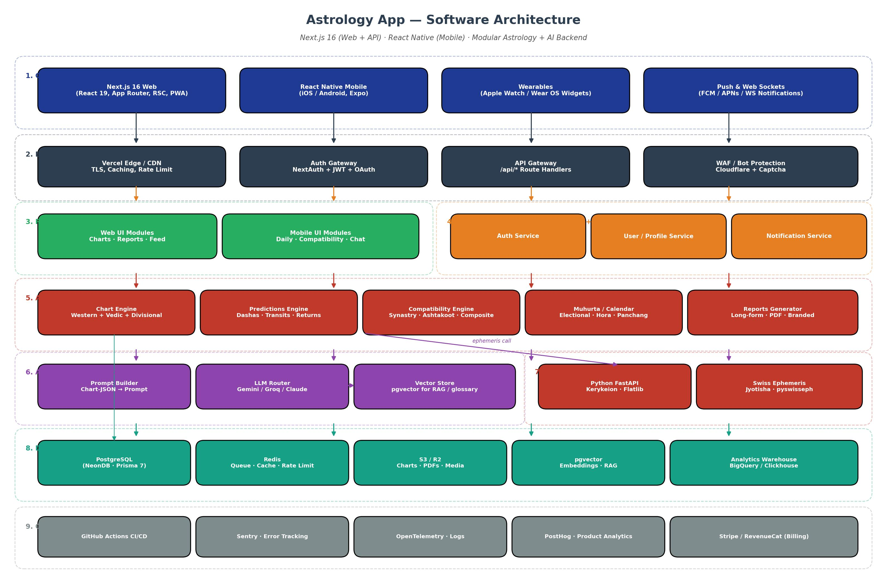
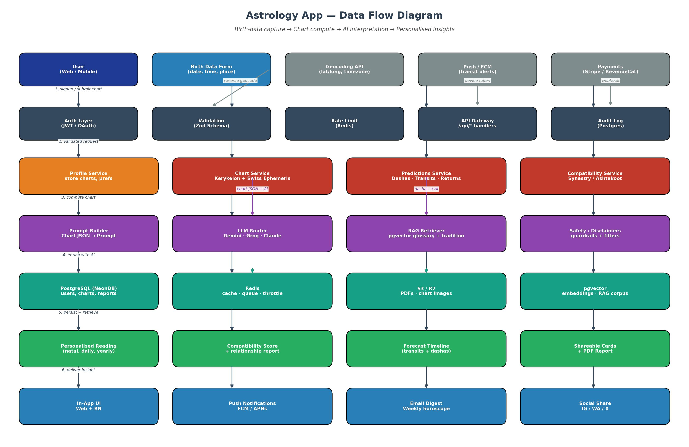

% Astrology App — Statement of Work
% Production-ready Western + Vedic/Jyotish Platform
% Version 1.0 · 2026-04-26

---

# Table of Contents

| # | Section | Page |
|---|---------|-----:|
| 1 | [Executive Summary](#1-executive-summary) | 1 |
| 2 | [Project Objectives](#2-project-objectives) | 2 |
| 3 | [Scope of Work](#3-scope-of-work) | 3 |
| 3.1 | [In-Scope](#31-in-scope) | 3 |
| 3.2 | [Out-of-Scope](#32-out-of-scope-this-sow) | 3 |
| 3.3 | [Assumptions](#33-assumptions) | 4 |
| 4 | [Feature List](#4-feature-list) | 5 |
| 4.1 | [User Management & Profiles](#41-user-management--profiles-p0) | 5 |
| 4.2 | [Chart Generation & Visualization](#42-chart-generation--visualization-p0) | 6 |
| 4.3 | [AI-Powered Interpretations & Predictions](#43-ai-powered-interpretations--predictions-p0p1) | 7 |
| 4.4 | [Compatibility & Relationship Tools](#44-compatibility--relationship-tools-p0p1) | 8 |
| 4.5 | [Calendar & Daily Tools](#45-calendar--daily-tools-p0p1) | 8 |
| 4.6 | [Community & Social Features](#46-community--social-features-p1p2) | 9 |
| 4.7 | [Education & Library](#47-education--library-p1) | 9 |
| 4.8 | [Advanced & Premium Modules](#48-advanced--premium-modules-p1p2) | 10 |
| 4.9 | [Technical & UX Features](#49-technical--ux-features-p0p1) | 10 |
| 4.10 | [Admin & Business Features](#410-admin--business-features-p0p1) | 11 |
| 5 | [Tech Stack](#5-tech-stack) | 12 |
| 5.1 | [Frontend (Web — Next.js 16)](#51-frontend-web--nextjs-16) | 12 |
| 5.2 | [Frontend (Mobile — React Native)](#52-frontend-mobile--react-native) | 13 |
| 5.3 | [Backend](#53-backend-nextjs-route-handlers--python-micro) | 13 |
| 5.4 | [LLM Strategy](#54-llm-strategy) | 14 |
| 5.5 | [Infrastructure & DevOps](#55-infrastructure--devops) | 14 |
| 6 | [Folder Structure (Standard Convention)](#6-folder-structure-standard-convention) | 15 |
| 6.1 | [Convention Rules](#61-convention-rules-must-be-followed-during-development) | 19 |
| 7 | [Architecture](#7-architecture) | 20 |
| 7.1 | [Why a Python compute microservice?](#71-why-a-python-compute-microservice) | 21 |
| 7.2 | [Why Next.js 16 route handlers?](#72-why-nextjs-16-route-handlers-not-a-separate-node-api) | 21 |
| 8 | [Data Flow](#8-data-flow) | 22 |
| 9 | [Database Selection](#9-database-selection) | 24 |
| 10 | [Database Schema](#10-database-schema) | 25 |
| 10.1 | [Indexing & Performance Notes](#101-indexing--performance-notes) | 36 |
| 10.2 | [Privacy & Compliance Notes](#102-privacy--compliance-notes) | 36 |
| 11 | [Non-Functional Requirements](#11-non-functional-requirements) | 37 |
| 12 | [Deliverables](#12-deliverables) | 38 |
| 13 | [Phasing & Milestones](#13-phasing--milestones) | 39 |
| 14 | [Engagement Model](#14-engagement-model) | 40 |
| 15 | [Risks & Mitigations](#15-risks--mitigations) | 41 |
| 16 | [Acceptance Criteria](#16-acceptance-criteria) | 42 |
| 17 | [Sign-Off](#17-sign-off) | 43 |

> **Note:** Section numbers above are stable anchors; page numbers are indicative for the Word/PDF render and are auto-regenerated by pandoc's `--toc` field when opened in Word.

---

# 1. Executive Summary

This Statement of Work (SoW) defines the scope, deliverables, technology, architecture, data model and engagement structure for the **Astrology App** — a production-grade, cross-platform consumer product covering both **Western** and **Vedic/Jyotish** astrology systems with deep AI-powered personalisation.

The platform is delivered as:

- **Web** application built on **Next.js 16** (React 19, App Router, RSC, PWA-ready).
- **Mobile** application built on **React Native** (iOS + Android) sharing typed contracts and business logic with web.
- A modular **astrology compute** layer (Swiss Ephemeris + Kerykeion + Jyotisha) and an **AI orchestration** layer with pluggable LLM backends (Gemini → Groq → Claude/GPT-4o), allowing free-tier-first operation that scales to paid tiers without code changes.

The product is feature-competitive with Co-Star, Sanctuary, AstroTalk and ClickAstro, with a stronger emphasis on **interactive AI chat with the chart**, **Vedic Dashas**, and **personalised long-form reports**.

---

# 2. Project Objectives

| # | Objective | Success Metric |
|---|-----------|----------------|
| 1 | Ship a feature-complete, production-grade Western + Vedic astrology app on Web and Mobile | All P0/P1 features in §4 in production |
| 2 | Achieve sub-second perceived response for daily horoscopes and chart interactions | p95 TTI < 1.2 s on 4G mid-range device |
| 3 | Deliver AI interpretations grounded in deterministic chart math (no hallucinated planet positions) | 100% of LLM prompts seeded by chart-engine JSON |
| 4 | Operate on a free LLM tier in Phase 1 and migrate seamlessly to paid tiers in Phase 2 | LLM swap requires only config change |
| 5 | Be GDPR/DPDP compliant (data export, deletion, consent) | Privacy controls + audit log live before launch |
| 6 | Achieve 99.5% monthly availability | Uptime SLO measured via synthetic checks |

---

# 3. Scope of Work

## 3.1 In-Scope

- Full feature list (§4), Web (Next.js 16) + Mobile (React Native) + Admin Web Console.
- Astrology computation microservice (Python FastAPI) wrapping Swiss Ephemeris/Kerykeion/Jyotisha.
- AI orchestration with prompt-builder, RAG (pgvector), multi-LLM router, safety filters.
- PostgreSQL (NeonDB) primary store with Prisma 7 ORM; Redis for cache/queue; S3-compatible object store for PDFs/images.
- Authentication (Email, Phone OTP, Google, Apple, Facebook), payments (Stripe + RevenueCat), notifications (FCM/APNs).
- CI/CD (GitHub Actions), observability (Sentry, OpenTelemetry, PostHog), and release management.
- Documentation: API reference (OpenAPI), developer onboarding, architecture, runbooks.

## 3.2 Out-of-Scope (this SoW)

- Live human astrologer marketplace with payouts (foundation only — directory + booking entity model in DB; payout pipeline is a separate engagement).
- Native widget development beyond a single "Daily horoscope" widget per platform.
- Translations beyond English + Hindi + 2 regional languages chosen at kickoff (additional locales contracted separately).
- Ad-network integration / monetisation outside in-app purchases & subscriptions.

## 3.3 Assumptions

- Client provides ephemeris data licences where required and brand assets (logo, palette, typography).
- Client supplies legal review for the disclaimer text shown alongside remedial suggestions (gems, mantras, etc.).
- Test devices for iOS and Android (one current + one mid-range each) are made available, or budgeted via BrowserStack.

---

# 4. Feature List

> Each item below is in scope. **P0** = launch-blocking, **P1** = required for the v1.0 release window, **P2** = post-launch fast follow within Phase 2.

## 4.1 User Management & Profiles  *(P0)*

- Secure signup/login: Email + Password, Phone OTP, Google, Apple, Facebook.
- Multi-profile support (Self, Partner, Children, Friends, Celebrity charts) — unlimited profiles per account, soft-cap at 50 to prevent abuse.
- Detailed birth-data entry: Date, exact time, place (auto timezone + lat/long via free geocoding API such as Nominatim / OpenCage free tier).
- "Unknown time" rectified-chart support (noon-default with a flag).
- Profile customization (avatar, bio, system preference: Western / Vedic / Both).
- Data export/import in **JSON** and **PDF** (PDF generated by chart engine + Puppeteer renderer).
- Privacy controls: per-chart visibility (Private, Shared with X, Public).

## 4.2 Chart Generation & Visualization  *(P0)*

- Natal/Birth Chart — Western and Vedic.
- Planetary positions, Ascendant, Houses, Nakshatras, **Divisional charts D1–D60** (D1, D2, D3, D7, D9, D10, D12, D16, D20, D24, D27, D30, D40, D45, D60).
- Multiple house systems: **Placidus, Whole Sign, Koch, Equal, Vedic Equal**.
- Aspect grid (Western orbs + Vedic *drishti*).
- Interactive chart wheel: SVG-rendered with zoom, planet highlights, configurable orb sliders.
- North Indian and South Indian style Vedic charts (SVG).
- Transit chart overlay on natal.
- Progressed charts: Secondary Progression and Solar Arc.
- Solar Return, Lunar Return, Annual (varshaphal) charts.
- Synastry (two charts overlaid).
- Composite, Davison, Relationship charts.
- **Horary** astrology module (question-based chart cast for current moment).
- **Electional** astrology — auspicious-timing finder over a user-defined window.

## 4.3 AI-Powered Interpretations & Predictions  *(P0/P1)*

- Instant personalised natal-chart reading: personality, strengths, challenges, life themes. *(P0)*
- Planet + House + Sign + Aspect deep interpretations. *(P0)*
- Daily, Weekly, Monthly, Yearly horoscopes — personalised via transits + dashas. *(P0)*
- Transit forecasts (next 1–10 years) with timelines and key dates. *(P1)*
- Vedic Dashas (Vimshottari, Yogini, Ashtottari) + *Gochara* predictions. *(P1)*
- **Ashtakavarga** & **ShadBala** analysis. *(P1)*
- Planetary strength & combustion alerts. *(P1)*
- Retrograde & eclipse impact reports. *(P1)*
- Long-form AI reports — Career & Wealth, Love & Marriage, Health & Well-being, Education & Learning Style, Spiritual Path & Karma. *(P1)*
- Remedial suggestions (gems, colours, mantras, yantras, lifestyle, charity) — **always behind a clearly marked disclaimer panel**. *(P1)*

## 4.4 Compatibility & Relationship Tools  *(P0/P1)*

- Romantic compatibility — Synastry + Composite + Vedic **Ashtakoot Milan** + Manglik check. *(P0)*
- Friendship & Business compatibility. *(P1)*
- Family compatibility (parents, siblings, children). *(P1)*
- Compatibility score (0–100) with detailed pros/cons. *(P0)*
- Relationship timeline & challenge periods. *(P1)*
- "Best match" finder using user-supplied preferences. *(P2)*

## 4.5 Calendar & Daily Tools  *(P0/P1)*

- Personalised daily planner with auspicious / inauspicious timings (**Muhurta**). *(P1)*
- Moon-phase calendar + void-of-course Moon. *(P1)*
- Planetary hours and planetary day calculator. *(P1)*
- Retrograde alerts and eclipse notifications. *(P0)*
- Custom event planner with astrological-suitability score. *(P1)*
- Push notifications for important transits, birthdays, anniversaries. *(P0)*

## 4.6 Community & Social Features  *(P1/P2)*

- Anonymous or public feed (share insights, questions). *(P1)*
- Astrologer directory (verified users; consultation booking shell, payouts deferred). *(P1)*
- Group compatibility (family, team, startup). *(P2)*
- Challenges and streaks (e.g., "30-day transit journal"). *(P2)*
- Shareable cards/stories for Instagram, WhatsApp. *(P0)*
- Private chat with saved charts (1:1, end-to-end-encrypted in Phase 2). *(P2)*

## 4.7 Education & Library  *(P1)*

- Searchable encyclopedia: Signs, Planets, Houses, Aspects, Nakshatras, Yogas.
- Video / audio lessons (curated YouTube embeds in Phase 1, native CMS in Phase 2).
- Glossary with illustrations.
- Mythology and deity connections.
- Beginner → Advanced learning paths with progress tracking.

## 4.8 Advanced & Premium Modules  *(P1/P2)*

- **AI Chat with Your Chart** — unlimited Q&A grounded in the user's chart JSON ("What career suits me in 2027?"). *(P0)*
- Custom AI report generator — user-chosen topic and length. *(P1)*
- Birth-time rectification using life events. *(P2)*
- Karma & past-life indicators (Western + Vedic). *(P2)*
- Fixed Stars and asteroids (Chiron, Lilith, Ceres, Pallas, Juno, Vesta). *(P1)*
- Arabic Parts and Lots. *(P2)*
- AstroCartoGraphy (location-based chart). *(P2)*
- Financial astrology (light version — market timing snapshots). *(P2)*
- Mundane astrology (world-events summary). *(P2)*

## 4.9 Technical & UX Features  *(P0/P1)*

- Offline access to saved charts and basic readings (mobile only — cached chart JSON + compiled reading). *(P1)*
- Dark / Light / Astro-themed UI with smooth animations (Framer Motion / Reanimated). *(P0)*
- Multi-language: English + Hindi + 2 regional Indian languages chosen at kickoff. *(P1)*
- Accessibility: VoiceOver / TalkBack support, WCAG AA contrast. *(P0)*
- Widget support — daily horoscope home-screen widget per platform. *(P1)*
- Apple Watch / Wear OS integration — daily transit glance complication. *(P2)*
- Backup and sync across devices (server-authoritative). *(P0)*
- Analytics dashboard for users (life themes, recurring patterns). *(P2)*

## 4.10 Admin & Business Features  *(P0/P1)*

- Content moderation tools (posts, profiles, reports). *(P1)*
- Usage analytics and user-retention metrics dashboard. *(P0)*
- A/B testing for interpretations (variant flag per prompt template). *(P1)*
- Easy switch between free/paid LLM backends — config-driven. *(P0)*
- Rate limiting & cost-monitoring dashboard for LLM spend. *(P0)*
- Referral system + affiliate pipeline for astrologers. *(P1)*

---

# 5. Tech Stack

## 5.1 Frontend (Web — Next.js 16)

| Layer | Choice | Notes |
|-------|--------|-------|
| Framework | **Next.js 16** (App Router, RSC, Server Actions) | Built on React 19; PWA-ready |
| UI library | **shadcn/ui** + **Radix UI** primitives | Themeable, accessible |
| Styling | **TailwindCSS 4** | Astro/dark/light themes |
| State | **Zustand** + **TanStack Query** | Local + server state |
| Forms | **React Hook Form** + **Zod** | Shared validators with backend |
| Charts (astro) | Custom SVG renderer + **D3** for interactions | Deterministic, accessible |
| Animations | **Framer Motion** | Wheel rotations, transitions |
| Auth client | **NextAuth v5** | OAuth + credentials + OTP |
| i18n | **next-intl** | EN, HI, plus 2 regional |
| PWA | **next-pwa** + service worker | Offline reading cache |
| Testing | **Vitest** + **Playwright** | Unit + E2E |

## 5.2 Frontend (Mobile — React Native)

| Layer | Choice | Notes |
|-------|--------|-------|
| Framework | **React Native** (Expo SDK, EAS Build) | iOS + Android |
| Navigation | **Expo Router** (file-based) | Mirrors web mental model |
| State | **Zustand** + **TanStack Query** | Same as web |
| UI | **Tamagui** or **Restyle** (decision at kickoff) | Themeable, performant |
| Charts (astro) | **react-native-svg** + custom renderer | Shares math layer with web |
| Animations | **Reanimated 3** + **Gesture Handler** | 60fps wheel interactions |
| Storage | **MMKV** (encrypted) + **expo-secure-store** | Tokens + cache |
| Notifications | **expo-notifications** + **FCM** + **APNs** | Transit alerts |
| Auth | **expo-auth-session** + **Sign in with Apple/Google** | Native flows |
| Testing | **Jest** + **Detox** | Unit + E2E |

## 5.3 Backend (Next.js Route Handlers + Python micro)

| Layer | Choice | Notes |
|-------|--------|-------|
| API surface | **Next.js 16** Route Handlers (`/api/*`) | Co-located with web |
| ORM | **Prisma 7** with `prisma.config.ts` + `@prisma/adapter-pg` | Per existing project conventions |
| Validation | **Zod** | Shared types front/back |
| Auth | **NextAuth v5** + JWT | OAuth + OTP + magic link |
| Astrology compute | **Python 3.12 FastAPI** microservice | Wraps Swiss Ephemeris, Kerykeion, Jyotisha |
| Astrology libraries | **pyswisseph**, **Kerykeion**, **Flatlib**, **Jyotisha**, **PVR** | Western + Vedic |
| LLM SDKs | **@anthropic-ai/sdk**, **@google/genai**, **groq-sdk**, **openai** | Pluggable router |
| Vector / RAG | **pgvector** (in NeonDB) | Glossary + tradition corpus |
| Queue / cache | **Redis** (Upstash) | Notifications, throttle, BullMQ jobs |
| Background jobs | **BullMQ** | Daily horoscope precompute, transit checks |
| Storage | **AWS S3** or **Cloudflare R2** | PDFs, chart images |
| Email | **Resend** | Transactional + weekly digest |
| Payments | **Stripe** (web) + **RevenueCat** (mobile) | Unified entitlements |
| Geocoding | **OpenCage** free tier (Phase 1) → paid (Phase 2) | Place → lat/long/timezone |

## 5.4 LLM Strategy

- **Phase 1 (free):** Gemini 2.5 Flash/Pro (primary), Groq Llama 3.3 70B (fast), Mistral free tier or OpenRouter free models (backup), Ollama (local dev).
- **Phase 2 (paid):** Claude 4.x for nuanced long-form reports, GPT-4o or Gemini Pro for general, Groq for speed-critical paths.
- **Implementation rule:** every LLM call passes through `backend/services/llm.router.ts` with provider, model and cost tier resolved from config — swapping provider is a config change.

## 5.5 Infrastructure & DevOps

| Concern | Choice |
|---------|--------|
| Hosting (web) | **Vercel** (Edge + Serverless) |
| Hosting (Python micro) | **Render** or **Fly.io** (autoscale, $0–$25/mo at start) |
| DB | **NeonDB** (Postgres + branching + pgvector) |
| Object storage | **Cloudflare R2** |
| CI/CD | **GitHub Actions** (lint, type, test, preview deploy) |
| Error tracking | **Sentry** (web + mobile + Python) |
| Telemetry | **OpenTelemetry** → **Grafana Cloud** free tier |
| Product analytics | **PostHog** Cloud free tier |
| Secrets | Vercel env + Doppler |
| Mobile distribution | **EAS Submit** → App Store / Play Store |

---

# 6. Folder Structure (Standard Convention)

> The convention below applies to the **Next.js 16 web/API package**. The React Native package mirrors `frontend/` and `shared/` but lives in a sibling app workspace (`apps/mobile`) when we move to a monorepo (Phase 2 — see §13).

```
.
├── src/
│   ├── app/                          # Next.js App Router (Frontend)
│   │   ├── (auth)/
│   │   │   ├── login/
│   │   │   │   └── page.tsx
│   │   │   ├── register/
│   │   │   │   └── page.tsx
│   │   │   └── layout.tsx
│   │   ├── (dashboard)/
│   │   │   ├── dashboard/
│   │   │   │   └── page.tsx
│   │   │   ├── settings/
│   │   │   │   └── page.tsx
│   │   │   └── layout.tsx
│   │   ├── layout.tsx
│   │   ├── page.tsx
│   │   └── globals.css
│   │
│   ├── backend/                      # Backend Layer (API Logic)
│   │   ├── api/                      # API Routes (Next.js handlers)
│   │   │   ├── auth/
│   │   │   │   └── route.ts
│   │   │   ├── users/
│   │   │   │   └── route.ts
│   │   │   ├── charts/
│   │   │   │   └── route.ts
│   │   │   ├── predictions/
│   │   │   │   └── route.ts
│   │   │   ├── compatibility/
│   │   │   │   └── route.ts
│   │   │   ├── ai-chat/
│   │   │   │   └── route.ts
│   │   │   └── middleware.ts
│   │   │
│   │   ├── services/                 # Business Logic Layer
│   │   │   ├── auth.service.ts
│   │   │   ├── user.service.ts
│   │   │   ├── chart.service.ts
│   │   │   ├── prediction.service.ts
│   │   │   ├── compatibility.service.ts
│   │   │   ├── llm.router.ts
│   │   │   ├── prompt-builder.service.ts
│   │   │   ├── notification.service.ts
│   │   │   └── email.service.ts
│   │   │
│   │   ├── repositories/             # Data Access Layer
│   │   │   ├── auth.repository.ts
│   │   │   ├── user.repository.ts
│   │   │   ├── chart.repository.ts
│   │   │   ├── prediction.repository.ts
│   │   │   └── report.repository.ts
│   │   │
│   │   ├── database/                 # Database Configuration
│   │   │   ├── prisma/
│   │   │   │   ├── schema.prisma
│   │   │   │   └── migrations/
│   │   │   ├── client.ts
│   │   │   └── seed.ts
│   │   │
│   │   ├── validators/               # Request Validation (Zod)
│   │   │   ├── auth.validator.ts
│   │   │   ├── user.validator.ts
│   │   │   ├── chart.validator.ts
│   │   │   ├── prediction.validator.ts
│   │   │   └── compatibility.validator.ts
│   │   │
│   │   └── utils/                    # Backend Utilities
│   │       ├── jwt.util.ts
│   │       ├── hash.util.ts
│   │       ├── rate-limit.util.ts
│   │       ├── pdf.util.ts
│   │       └── error-handler.util.ts
│   │
│   ├── frontend/                     # Frontend-Specific Logic
│   │   ├── components/               # React Components
│   │   │   ├── ui/                   # Reusable UI Components
│   │   │   │   ├── Button.tsx
│   │   │   │   ├── Input.tsx
│   │   │   │   ├── Modal.tsx
│   │   │   │   └── Card.tsx
│   │   │   ├── features/             # Feature-Specific Components
│   │   │   │   ├── auth/
│   │   │   │   │   ├── LoginForm.tsx
│   │   │   │   │   └── RegisterForm.tsx
│   │   │   │   ├── chart/
│   │   │   │   │   ├── ChartWheel.tsx
│   │   │   │   │   ├── NorthIndianChart.tsx
│   │   │   │   │   ├── SouthIndianChart.tsx
│   │   │   │   │   └── AspectGrid.tsx
│   │   │   │   ├── predictions/
│   │   │   │   │   ├── DailyHoroscope.tsx
│   │   │   │   │   └── TransitTimeline.tsx
│   │   │   │   ├── compatibility/
│   │   │   │   │   ├── SynastryView.tsx
│   │   │   │   │   └── AshtakootScore.tsx
│   │   │   │   └── ai-chat/
│   │   │   │       └── ChartChat.tsx
│   │   │   └── layout/
│   │   │       ├── Header.tsx
│   │   │       ├── Sidebar.tsx
│   │   │       └── Footer.tsx
│   │   │
│   │   ├── hooks/                    # Custom React Hooks
│   │   │   ├── useAuth.ts
│   │   │   ├── useUser.ts
│   │   │   ├── useChart.ts
│   │   │   ├── usePredictions.ts
│   │   │   └── useCompatibility.ts
│   │   │
│   │   ├── store/                    # State Management (Zustand)
│   │   │   ├── authStore.ts
│   │   │   ├── userStore.ts
│   │   │   ├── chartStore.ts
│   │   │   └── appStore.ts
│   │   │
│   │   ├── api/                      # Frontend API Client Layer
│   │   │   ├── client.ts             # Axios / fetch wrapper + interceptors
│   │   │   ├── endpoints/
│   │   │   │   ├── auth.api.ts
│   │   │   │   ├── users.api.ts
│   │   │   │   ├── charts.api.ts
│   │   │   │   ├── predictions.api.ts
│   │   │   │   └── compatibility.api.ts
│   │   │   └── types/                # API Request/Response types
│   │   │       ├── auth.types.ts
│   │   │       ├── user.types.ts
│   │   │       ├── chart.types.ts
│   │   │       └── prediction.types.ts
│   │   │
│   │   └── utils/                    # Frontend Utilities
│   │       ├── formatters.ts
│   │       ├── validators.ts
│   │       └── constants.ts
│   │
│   ├── shared/                       # Shared Between Frontend & Backend
│   │   ├── types/                    # Shared TypeScript Types
│   │   │   ├── user.types.ts
│   │   │   ├── chart.types.ts
│   │   │   ├── prediction.types.ts
│   │   │   └── common.types.ts
│   │   ├── constants/
│   │   │   ├── routes.ts
│   │   │   ├── nakshatras.ts
│   │   │   ├── signs.ts
│   │   │   └── errors.ts
│   │   └── utils/
│   │       └── common.util.ts
│   │
│   └── config/                       # Configuration Files
│       ├── env.ts                    # Env variable validation (Zod)
│       ├── api.config.ts
│       ├── llm.config.ts             # LLM provider/model routing
│       └── app.config.ts
│
├── public/                           # Static Assets
│   ├── images/
│   └── icons/
│
├── tests/                            # Test Files
│   ├── unit/
│   ├── integration/
│   └── e2e/
│
├── .env.local                        # Local Environment Variables
├── .env.development
├── .env.production
├── next.config.ts
├── tsconfig.json
├── package.json
└── README.md
```

### 6.1 Convention Rules (must be followed during development)

1. **`app/` is presentation only.** No business logic, no DB calls, no LLM calls inside `page.tsx` / `layout.tsx`. Route handlers live under `backend/api/`.
2. **Three-layer backend.** `api → service → repository`. Route handlers parse + validate input, call services, format output. Services contain business rules. Repositories own all Prisma access.
3. **Validators first.** Every API route validates input against a Zod schema in `backend/validators/` before reaching the service.
4. **Shared types are the source of truth.** Frontend and backend both import DTOs from `src/shared/types`. Never duplicate.
5. **`frontend/api/` mirrors `backend/api/`.** A new endpoint requires a matching client function under the same module name.
6. **No raw fetches in components.** Components use hooks (`frontend/hooks/`) which use the client (`frontend/api/`).
7. **State**: server state via TanStack Query, UI state via Zustand stores. Never store server data in Zustand.
8. **Config wins over branching.** Behaviour differences (LLM provider, geocoder, payment provider) live in `config/`, not in `if/else` inside services.
9. **Tests mirror source layout.** `tests/unit/services/chart.service.test.ts` ↔ `src/backend/services/chart.service.ts`.

---

# 7. Architecture



The platform is organised in nine concentric layers:

1. **Client Layer** — Next.js 16 web app, React Native mobile app, wearable widgets, push channels.
2. **Edge / Gateway Layer** — Vercel Edge, NextAuth, API gateway (Next.js route handlers), Cloudflare WAF.
3. **Presentation Logic** — UI modules for charts, reports, feed, daily, compatibility, chat (web + mobile share contracts and math).
4. **Backend (Route Handlers + Services)** — auth, profile, notification orchestration on the Node runtime.
5. **Astrology Domain Services** — chart engine, predictions engine (Dashas/transits/returns), compatibility engine (Synastry/Ashtakoot/composite), Muhurta/calendar engine, reports generator.
6. **AI / LLM Orchestration** — prompt builder, LLM router (Gemini → Groq → Claude → GPT), pgvector RAG, safety filters and disclaimer enforcement.
7. **Astrology Compute Microservice** — Python FastAPI wrapping `pyswisseph`, Kerykeion and Jyotisha for accurate ephemeris-based math; called via internal REST.
8. **Data Layer** — PostgreSQL (NeonDB) primary, Redis (Upstash) for cache/queue, S3/R2 for binary assets, pgvector for embeddings, BigQuery/Clickhouse for analytics warehouse.
9. **Observability & DevOps** — GitHub Actions, Sentry, OpenTelemetry, PostHog, Stripe / RevenueCat billing.

### 7.1 Why a Python compute microservice?

Swiss Ephemeris, Kerykeion and Jyotisha are mature in Python and produce identical, deterministic results. Re-implementing in Node would risk subtle errors in astronomical math. We isolate Python in a small FastAPI service and call it from the Node services — Node owns user-facing logic, Python owns numbers.

### 7.2 Why Next.js 16 route handlers (not a separate Node API)?

- Single deployment target, single auth/session boundary, lower ops overhead.
- Server Actions + RSC reduce round trips for chart fetches.
- The same code can be consumed by the React Native app via the same `/api/*` URL set.

---

# 8. Data Flow



End-to-end flow for a typical "give me my reading" interaction:

1. **Capture** — User submits birth data (web or mobile). Geocoding API resolves place → lat/long/timezone. Push token / payment events feed in via webhooks.
2. **Edge** — Auth (JWT/OAuth) verifies the session. Zod validates payload. Redis enforces rate limits. The request hits the appropriate `/api/*` handler. Audit log writes the request envelope.
3. **Domain** — The chart service calls the Python compute microservice, which returns deterministic chart JSON (planets, houses, aspects, dashas, divisional charts). Predictions and compatibility services build derivative structures.
4. **AI** — The prompt builder converts chart JSON into a typed prompt template. The LLM router chooses a provider/model based on cost tier and route SLO. RAG retrieves relevant glossary/tradition snippets from pgvector. Safety filters strip / annotate any medical, legal or financial claims and append disclaimers.
5. **Persist & Retrieve** — Generated readings, charts and reports are written to PostgreSQL; binary assets (PDF, share cards) to S3/R2; user-bound embeddings to pgvector for personalised recall.
6. **Deliver** — The personalised reading is rendered in-app, pushed via FCM/APNs, emailed weekly, or exported as a shareable card / PDF.

Latency budget for the daily horoscope path:

| Step | Target p50 | Target p95 |
|------|-----------:|-----------:|
| Edge + auth + validation | 30 ms | 80 ms |
| Chart compute (Python micro, cached) | 20 ms | 120 ms |
| LLM call (Gemini Flash, cached prompt) | 600 ms | 1500 ms |
| RAG retrieval | 30 ms | 90 ms |
| Render + return | 40 ms | 120 ms |
| **Total** | **~720 ms** | **~1900 ms** |

---

# 9. Database Selection

| Concern | Choice | Reason |
|---------|--------|--------|
| Primary OLTP | **PostgreSQL on NeonDB** | Branching, point-in-time recovery, free tier, scales serverless, supports `pgvector` natively. Aligns with existing project convention (Prisma 7 + `@prisma/adapter-pg`). |
| Vector / RAG | **pgvector** (extension on NeonDB) | One DB to operate, transactional joins between user data and embeddings. |
| Cache / queue | **Redis (Upstash)** | Free tier, REST-friendly from edge, BullMQ for jobs. |
| Object storage | **Cloudflare R2** (or S3) | Cheap egress for chart PDFs and share cards. |
| Analytics warehouse | **BigQuery** (or Clickhouse Cloud) | Long-term event store; isolated from OLTP. |
| Search (Phase 2) | **Postgres FTS** initially, **Meilisearch** if needed | Glossary, astrologer directory. |

> **Why not MongoDB / Firebase?** The domain has highly relational data (charts ↔ users ↔ profiles ↔ readings ↔ subscriptions). Postgres + Prisma 7 keeps integrity and migrations clean while still allowing JSONB columns for chart payloads and AI metadata.

---

# 10. Database Schema

> Modelled in **Prisma 7** (`schema.prisma`) for **PostgreSQL on NeonDB**. JSONB is used for the deterministic chart payload and AI metadata to keep relational rows narrow while preserving full structural fidelity. Soft-deletes via `deletedAt`. All timestamps in UTC.

```prisma
// prisma/schema.prisma
generator client {
  provider        = "prisma-client-js"
  previewFeatures = ["driverAdapters", "postgresqlExtensions"]
}

datasource db {
  provider   = "postgresql"
  extensions = [pgvector(map: "vector")]
}

// =========================
// 1. AUTH & USERS
// =========================

enum UserRole {
  USER
  ASTROLOGER
  ADMIN
  MODERATOR
}

enum AuthProvider {
  EMAIL
  PHONE_OTP
  GOOGLE
  APPLE
  FACEBOOK
}

enum AstroSystem {
  WESTERN
  VEDIC
  BOTH
}

model User {
  id              String       @id @default(cuid())
  email           String?      @unique
  phone           String?      @unique
  passwordHash    String?
  emailVerifiedAt DateTime?
  phoneVerifiedAt DateTime?
  role            UserRole     @default(USER)
  systemPref      AstroSystem  @default(BOTH)
  locale          String       @default("en")
  timezone        String?
  avatarUrl       String?
  bio             String?
  referralCode    String       @unique @default(cuid())
  referredById    String?
  referredBy      User?        @relation("Referrals", fields: [referredById], references: [id])
  referrals       User[]       @relation("Referrals")
  createdAt       DateTime     @default(now())
  updatedAt       DateTime     @updatedAt
  deletedAt       DateTime?

  authProviders   AuthIdentity[]
  profiles        Profile[]
  charts          Chart[]
  reports         Report[]
  predictions     Prediction[]
  subscriptions   Subscription[]
  notifications   Notification[]
  posts           Post[]
  comments        Comment[]
  chatSessions    AiChatSession[]
  consents        Consent[]
  auditLogs       AuditLog[]

  @@index([deletedAt])
}

model AuthIdentity {
  id          String       @id @default(cuid())
  userId      String
  user        User         @relation(fields: [userId], references: [id], onDelete: Cascade)
  provider    AuthProvider
  providerUid String
  metadata    Json?
  createdAt   DateTime     @default(now())

  @@unique([provider, providerUid])
  @@index([userId])
}

model Session {
  id           String   @id @default(cuid())
  userId       String
  refreshToken String   @unique
  userAgent    String?
  ip           String?
  expiresAt    DateTime
  createdAt    DateTime @default(now())
  revokedAt    DateTime?

  @@index([userId])
}

// =========================
// 2. PROFILES (multi-profile per account)
// =========================

enum ProfileKind {
  SELF
  PARTNER
  CHILD
  FRIEND
  CELEBRITY
  OTHER
}

model Profile {
  id            String      @id @default(cuid())
  userId        String
  user          User        @relation(fields: [userId], references: [id], onDelete: Cascade)
  kind          ProfileKind
  fullName      String
  birthDate     DateTime
  birthTime     DateTime?       // null = unknown time
  unknownTime   Boolean        @default(false)
  birthPlace    String
  latitude      Decimal        @db.Decimal(9, 6)
  longitude     Decimal        @db.Decimal(9, 6)
  timezone      String          // IANA tz
  gender        String?
  notes         String?
  isPrivate     Boolean        @default(true)
  createdAt     DateTime       @default(now())
  updatedAt     DateTime       @updatedAt
  deletedAt     DateTime?

  charts        Chart[]
  predictions   Prediction[]
  reports       Report[]
  compatibilityA Compatibility[] @relation("CompatibilityA")
  compatibilityB Compatibility[] @relation("CompatibilityB")

  @@index([userId])
  @@index([kind])
}

// =========================
// 3. CHARTS (deterministic compute output)
// =========================

enum HouseSystem {
  PLACIDUS
  WHOLE_SIGN
  KOCH
  EQUAL
  VEDIC_EQUAL
}

enum ChartKind {
  NATAL
  TRANSIT
  PROGRESSED_SECONDARY
  PROGRESSED_SOLAR_ARC
  SOLAR_RETURN
  LUNAR_RETURN
  ANNUAL_VARSHA
  COMPOSITE
  DAVISON
  HORARY
  ELECTIONAL
  DIVISIONAL          // D2..D60
}

model Chart {
  id           String       @id @default(cuid())
  userId       String
  user         User         @relation(fields: [userId], references: [id], onDelete: Cascade)
  profileId    String?
  profile      Profile?     @relation(fields: [profileId], references: [id], onDelete: SetNull)
  kind         ChartKind
  system       AstroSystem
  houseSystem  HouseSystem
  divisionalIx Int?         // 1..60 for divisional charts
  computedAt   DateTime     @default(now())
  // Deterministic chart JSON — planets, houses, aspects, dashas, nakshatras
  payload      Json
  // Derived hash for cache lookups (input-stable)
  inputHash    String
  expiresAt    DateTime?    // for transit / return charts

  predictions  Prediction[]
  reports      Report[]
  embeddings   Embedding[]

  @@index([userId])
  @@index([profileId])
  @@index([kind, system])
  @@unique([profileId, kind, system, houseSystem, divisionalIx, inputHash])
}

// =========================
// 4. PREDICTIONS / READINGS / REPORTS
// =========================

enum PredictionKind {
  DAILY
  WEEKLY
  MONTHLY
  YEARLY
  TRANSIT_FORECAST
  DASHA_VIMSHOTTARI
  DASHA_YOGINI
  DASHA_ASHTOTTARI
  ASHTAKAVARGA
  SHADBALA
  RETROGRADE_ALERT
  ECLIPSE_IMPACT
  MUHURTA
  HORARY_ANSWER
  ELECTIONAL_RANKING
}

model Prediction {
  id           String         @id @default(cuid())
  userId       String
  user         User           @relation(fields: [userId], references: [id], onDelete: Cascade)
  profileId    String?
  profile      Profile?       @relation(fields: [profileId], references: [id], onDelete: SetNull)
  chartId      String?
  chart        Chart?         @relation(fields: [chartId], references: [id], onDelete: SetNull)
  kind         PredictionKind
  periodStart  DateTime
  periodEnd    DateTime
  // Source of truth — chart-derived facts
  facts        Json
  // LLM-rendered text + metadata
  text         String
  llmProvider  String         // "gemini" | "groq" | "anthropic" | "openai"
  llmModel     String
  promptHash   String
  costUsdMicro Int            @default(0) // cost in USD * 1_000_000
  createdAt    DateTime       @default(now())

  @@index([userId, periodStart])
  @@index([profileId, kind])
}

enum ReportKind {
  NATAL_FULL
  CAREER_WEALTH
  LOVE_MARRIAGE
  HEALTH
  EDUCATION
  SPIRITUAL
  CUSTOM
  COMPATIBILITY
  YEARLY_VARSHA
}

model Report {
  id           String     @id @default(cuid())
  userId       String
  user         User       @relation(fields: [userId], references: [id], onDelete: Cascade)
  profileId    String?
  profile      Profile?   @relation(fields: [profileId], references: [id], onDelete: SetNull)
  chartId      String?
  chart        Chart?     @relation(fields: [chartId], references: [id], onDelete: SetNull)
  kind         ReportKind
  title        String
  // markdown body, rendered to HTML/PDF on demand
  bodyMarkdown String     @db.Text
  pdfUrl       String?    // signed S3/R2 URL
  llmProvider  String?
  llmModel     String?
  costUsdMicro Int        @default(0)
  createdAt    DateTime   @default(now())
  updatedAt    DateTime   @updatedAt

  @@index([userId, kind])
}

// =========================
// 5. COMPATIBILITY
// =========================

enum CompatibilityKind {
  ROMANTIC
  FRIENDSHIP
  BUSINESS
  FAMILY
}

model Compatibility {
  id           String            @id @default(cuid())
  kind         CompatibilityKind
  profileAId   String
  profileA     Profile           @relation("CompatibilityA", fields: [profileAId], references: [id], onDelete: Cascade)
  profileBId   String
  profileB     Profile           @relation("CompatibilityB", fields: [profileBId], references: [id], onDelete: Cascade)
  // 0..100
  score        Int
  // Western synastry, Vedic ashtakoot, manglik, composite — all in JSON
  details      Json
  text         String?           @db.Text   // optional AI-rendered narrative
  createdAt    DateTime          @default(now())

  @@unique([kind, profileAId, profileBId])
}

// =========================
// 6. AI CHAT WITH CHART
// =========================

model AiChatSession {
  id          String       @id @default(cuid())
  userId      String
  user        User         @relation(fields: [userId], references: [id], onDelete: Cascade)
  profileId   String?
  chartId     String?
  title       String?
  createdAt   DateTime     @default(now())
  updatedAt   DateTime     @updatedAt

  messages    AiChatMessage[]

  @@index([userId])
}

enum ChatRole { USER ASSISTANT SYSTEM TOOL }

model AiChatMessage {
  id          String        @id @default(cuid())
  sessionId   String
  session     AiChatSession @relation(fields: [sessionId], references: [id], onDelete: Cascade)
  role        ChatRole
  content     String        @db.Text
  toolCalls   Json?
  llmProvider String?
  llmModel    String?
  tokenCount  Int?
  costUsdMicro Int          @default(0)
  createdAt   DateTime      @default(now())

  @@index([sessionId, createdAt])
}

// =========================
// 7. RAG / EMBEDDINGS
// =========================

enum EmbeddingScope {
  GLOSSARY
  TRADITION
  USER_NOTES
  CHART_FACTS
}

model Embedding {
  id        String         @id @default(cuid())
  scope     EmbeddingScope
  refId     String?        // optional FK to chart, report, glossary entry
  chart     Chart?         @relation(fields: [refId], references: [id], onDelete: Cascade, map: "Embedding_chart_fkey")
  source    String         // "glossary:placidus", "tradition:bphs:ch3", etc.
  text      String         @db.Text
  vector    Unsupported("vector(1536)")
  metadata  Json?
  createdAt DateTime       @default(now())

  @@index([scope])
}

// =========================
// 8. CONTENT / EDUCATION
// =========================

enum GlossaryKind { SIGN PLANET HOUSE ASPECT NAKSHATRA YOGA DASHA OTHER }

model GlossaryEntry {
  id          String       @id @default(cuid())
  kind        GlossaryKind
  slug        String       @unique
  title       String
  bodyMarkdown String      @db.Text
  imageUrl    String?
  locale      String       @default("en")
  createdAt   DateTime     @default(now())
  updatedAt   DateTime     @updatedAt

  @@index([kind, locale])
}

model LearningPath {
  id          String   @id @default(cuid())
  slug        String   @unique
  title       String
  level       String   // BEGINNER | INTERMEDIATE | ADVANCED
  bodyMarkdown String  @db.Text
  ordering    Int
  createdAt   DateTime @default(now())
  updatedAt   DateTime @updatedAt
}

// =========================
// 9. COMMUNITY / FEED
// =========================

enum PostVisibility { PUBLIC ANONYMOUS PRIVATE }

model Post {
  id         String         @id @default(cuid())
  userId     String
  user       User           @relation(fields: [userId], references: [id], onDelete: Cascade)
  body       String         @db.Text
  visibility PostVisibility @default(PUBLIC)
  chartId    String?
  createdAt  DateTime       @default(now())
  updatedAt  DateTime       @updatedAt
  deletedAt  DateTime?

  comments   Comment[]
  reactions  Reaction[]

  @@index([userId])
  @@index([visibility, createdAt])
}

model Comment {
  id        String   @id @default(cuid())
  postId    String
  post      Post     @relation(fields: [postId], references: [id], onDelete: Cascade)
  userId    String
  user      User     @relation(fields: [userId], references: [id], onDelete: Cascade)
  body      String   @db.Text
  createdAt DateTime @default(now())
  deletedAt DateTime?

  @@index([postId])
}

model Reaction {
  id     String @id @default(cuid())
  postId String
  userId String
  type   String // "like" | "star" | "fire" ...
  post   Post   @relation(fields: [postId], references: [id], onDelete: Cascade)

  @@unique([postId, userId, type])
}

// =========================
// 10. CALENDAR / EVENTS / NOTIFICATIONS
// =========================

enum EventKind {
  CUSTOM
  TRANSIT
  RETROGRADE
  ECLIPSE
  BIRTHDAY
  ANNIVERSARY
  MUHURTA
}

model Event {
  id          String    @id @default(cuid())
  userId      String
  user        User      @relation(fields: [userId], references: [id], onDelete: Cascade)
  kind        EventKind
  title       String
  description String?
  startsAt    DateTime
  endsAt      DateTime?
  // suitability score 0..100 if astrology-enabled
  score       Int?
  payload     Json?
  createdAt   DateTime  @default(now())

  @@index([userId, startsAt])
}

enum NotificationKind {
  TRANSIT
  RETROGRADE
  ECLIPSE
  BIRTHDAY
  REPORT_READY
  PAYMENT
  SOCIAL
  SYSTEM
}

model Notification {
  id        String           @id @default(cuid())
  userId    String
  user      User             @relation(fields: [userId], references: [id], onDelete: Cascade)
  kind      NotificationKind
  title     String
  body      String
  payload   Json?
  readAt    DateTime?
  sentAt    DateTime?
  createdAt DateTime         @default(now())

  @@index([userId, createdAt])
}

model DeviceToken {
  id        String   @id @default(cuid())
  userId    String
  platform  String   // "ios" | "android" | "web"
  token     String   @unique
  createdAt DateTime @default(now())
  revokedAt DateTime?

  @@index([userId])
}

// =========================
// 11. PAYMENTS / SUBSCRIPTIONS
// =========================

enum PlanTier { FREE PLUS PRO ASTROLOGER }
enum SubscriptionStatus { TRIALING ACTIVE PAST_DUE CANCELED EXPIRED }

model Plan {
  id           String   @id @default(cuid())
  tier         PlanTier @unique
  name         String
  monthlyUsd   Int      // cents
  annualUsd    Int
  features     Json     // entitlements
  createdAt    DateTime @default(now())
}

model Subscription {
  id              String             @id @default(cuid())
  userId          String
  user            User               @relation(fields: [userId], references: [id], onDelete: Cascade)
  planId          String
  plan            Plan               @relation(fields: [planId], references: [id])
  provider        String             // "stripe" | "revenuecat"
  providerCustomerId String?
  providerSubId   String?
  status          SubscriptionStatus
  currentPeriodEnd DateTime?
  trialEnd        DateTime?
  createdAt       DateTime           @default(now())
  updatedAt       DateTime           @updatedAt

  @@index([userId])
}

model Invoice {
  id              String   @id @default(cuid())
  subscriptionId  String
  subscription    Subscription @relation(fields: [subscriptionId], references: [id], onDelete: Cascade)
  amountUsd       Int      // cents
  currency        String   @default("USD")
  paidAt          DateTime?
  providerInvoiceId String?
  raw             Json?
  createdAt       DateTime @default(now())

  @@index([subscriptionId])
}

// =========================
// 12. ADMIN / OPS
// =========================

model FeatureFlag {
  id          String   @id @default(cuid())
  key         String   @unique
  description String?
  variants    Json     // { control: 0.5, variantA: 0.5 }
  enabled     Boolean  @default(true)
  updatedAt   DateTime @updatedAt
}

model LlmCallLog {
  id          String   @id @default(cuid())
  userId      String?
  route       String   // "/api/predictions/daily"
  provider    String
  model       String
  promptHash  String
  inputTokens Int
  outputTokens Int
  costUsdMicro Int
  latencyMs   Int
  status      String   // "ok" | "error" | "timeout"
  error       String?
  createdAt   DateTime @default(now())

  @@index([provider, createdAt])
  @@index([route, createdAt])
}

model Consent {
  id        String   @id @default(cuid())
  userId    String
  user      User     @relation(fields: [userId], references: [id], onDelete: Cascade)
  policy    String   // "tos_v1" | "privacy_v2" | "marketing_emails"
  acceptedAt DateTime @default(now())
  ip        String?

  @@unique([userId, policy])
}

model AuditLog {
  id        String   @id @default(cuid())
  userId    String?
  user      User?    @relation(fields: [userId], references: [id], onDelete: SetNull)
  action    String   // "user.login", "chart.create", ...
  entity    String?
  entityId  String?
  payload   Json?
  ip        String?
  createdAt DateTime @default(now())

  @@index([userId, createdAt])
  @@index([action, createdAt])
}

model Referral {
  id            String   @id @default(cuid())
  referrerId    String
  refereeId     String
  rewardedAt    DateTime?
  rewardUsdMicro Int     @default(0)
  createdAt     DateTime @default(now())

  @@unique([referrerId, refereeId])
}
```

### 10.1 Indexing & Performance Notes

- All `userId` columns are indexed; multi-column indexes match dominant query shapes (`@@index([userId, createdAt])`, `@@index([userId, periodStart])`).
- `Chart.inputHash` enables idempotent compute caching — identical birth data → identical chart JSON without recomputing.
- `Embedding.vector` uses pgvector with HNSW or IVFFlat (decided after corpus sizing) for sub-100ms similarity search.
- Hot tables (`Notification`, `LlmCallLog`, `AuditLog`) are partitioned monthly in Phase 2 once data growth justifies it.

### 10.2 Privacy & Compliance Notes

- `Consent` table tracks every policy acceptance (TOS, Privacy, Marketing) with version + timestamp.
- Soft-delete via `deletedAt` on `User`, `Profile`, `Post`, `Comment` — backed by a daily purger that hard-deletes after 30 days.
- All birth data is treated as sensitive PII. Backups encrypted at rest (NeonDB) and in transit (TLS 1.3).
- Right-to-erasure honoured via `/api/users/me/delete` which queues a cascading purge.

---

# 11. Non-Functional Requirements

| Concern | Target |
|---------|--------|
| Availability | 99.5% monthly uptime |
| p95 latency (daily horoscope) | < 1.9 s end-to-end |
| p95 latency (chart compute, cached) | < 250 ms |
| Mobile cold-start | < 2.5 s on iPhone 12 / Pixel 6 |
| Accessibility | WCAG 2.2 AA |
| Security | OWASP ASVS L2; OAuth, JWT rotation, rate limiting on every public endpoint |
| Privacy | GDPR + India DPDP-aligned; export & delete in-app |
| Localisation | EN + HI + 2 regional at launch; framework supports unlimited locales |
| Observability | 100% of API routes traced; LLM cost per route visible in dashboard |

---

# 12. Deliverables

| # | Deliverable | Format |
|---|-------------|--------|
| D1 | Web app (Next.js 16) — production build & Vercel deployment | URL + repo |
| D2 | Mobile app (React Native) — iOS + Android builds in respective stores | TestFlight + Play Internal track → Production |
| D3 | Astrology compute microservice (Python FastAPI) — deployed to Render/Fly | URL + repo |
| D4 | Admin web console — feature flags, moderation, LLM-cost dashboard | URL |
| D5 | Database — NeonDB project with `schema.prisma` + seed data | DB URL + migrations in repo |
| D6 | API documentation — OpenAPI 3.1 + Stoplight portal | URL |
| D7 | This SoW (`sow.md` + `sow.docx`) and architecture/data-flow JPEGs | Repo: `docs/sow/` |
| D8 | Test suites — Vitest unit, Playwright E2E (web), Detox E2E (mobile) | CI green |
| D9 | Runbooks — deploys, rollbacks, incident response, LLM-vendor switch | Repo: `docs/runbooks/` |
| D10 | Onboarding doc — local dev setup, conventions, contribution guide | `README.md` + `CONTRIBUTING.md` |

---

# 13. Phasing & Milestones

> Suggested 5-month timeline (calendar weeks). Adjust at kickoff.

| Phase | Weeks | Outcomes |
|-------|------:|----------|
| **0. Discovery & Setup** | 1–2 | Repo scaffold, NeonDB project, Vercel + Render projects, design system kickoff, kickoff workshop |
| **1. Foundations** | 3–6 | Auth + Profiles + Birth-data form + Geocoding + Chart compute (Western & Vedic) + Chart wheel UI + DB schema + admin shell |
| **2. AI & Predictions** | 7–10 | LLM router + Prompt builder + RAG + Daily/Weekly/Monthly horoscopes + AI Chat with Chart + long-form reports |
| **3. Compatibility & Calendar** | 11–13 | Synastry + Composite + Ashtakoot + Manglik + Muhurta + transit/eclipse alerts + push pipeline |
| **4. Mobile parity & Polish** | 14–17 | React Native parity, offline cache, share cards, widgets, accessibility audit, i18n (EN/HI/+2) |
| **5. Hardening & Launch** | 18–20 | Load testing, security review, store submissions, marketing site, soft-launch |

A monorepo migration (Turborepo + pnpm workspaces) is recommended at the start of Phase 4 so web and mobile can cleanly share the `shared/` types and `chart-engine` SDK.

---

# 14. Engagement Model

- **Working mode:** weekly sprint, demo every Friday, written status note Monday.
- **Source control:** GitHub; trunk-based with short-lived feature branches; PR template + at least one reviewer.
- **Issue tracking:** Linear (or GitHub Projects).
- **Communication:** Slack channel + shared calendar; async-first.
- **Definition of Done:** code merged to `main`, tests green, type checks pass, Storybook entry added (UI), deployed to staging, smoke-tested.

---

# 15. Risks & Mitigations

| Risk | Impact | Mitigation |
|------|--------|------------|
| LLM hallucinations (wrong planet positions, wrong dasha) | Trust-killer | All math is computed by Python micro; LLM only narrates from supplied JSON; unit tests assert chart JSON ↔ Swiss Ephemeris reference data |
| Free LLM tier rate-limited at scale | Outage | Multi-provider router with circuit breakers + cached daily horoscopes (24 h TTL) |
| App-store rejection for "spiritual / fortune-telling" content | Launch delay | Disclaimers on every remedial / predictive surface; no medical / financial absolute claims; entertainment-purpose framing reviewed by counsel |
| Birth-data PII leak | Regulatory + reputational | Encrypted at rest, signed object URLs, role-based access, audit log on every read of `Profile` |
| Ephemeris licence ambiguity | Legal | Confirm Swiss Ephemeris licence path (GNU GPL or paid) at kickoff; choose licence-clean Vedic libs |
| Cost runaway from LLM use | Margin | Per-user daily cost cap, per-route caching, paid tiers behind subscription |

---

# 16. Acceptance Criteria

The SoW is considered fulfilled when:

1. All P0 + P1 features in §4 are deployed to production and accessible via signed-off URLs / store builds.
2. Acceptance test suites (web E2E, mobile E2E, API contract) are green in CI on `main` for 7 consecutive days.
3. The architecture matches §7 and the folder convention in §6 is observed across the codebase.
4. The DB schema in §10 is migrated, seeded, and reflected in OpenAPI types.
5. SLOs in §11 are demonstrated against load tests for the daily-horoscope and chart-compute paths.
6. Documentation (D6, D7, D9, D10) is delivered and reviewed.

---

# 17. Sign-Off

| Role | Name | Date | Signature |
|------|------|------|-----------|
| Client (Product Owner) | | | |
| Engineering Lead | | | |
| Design Lead | | | |
| Compliance / Legal | | | |

---

*End of Statement of Work — version 1.0 — 2026-04-26.*
